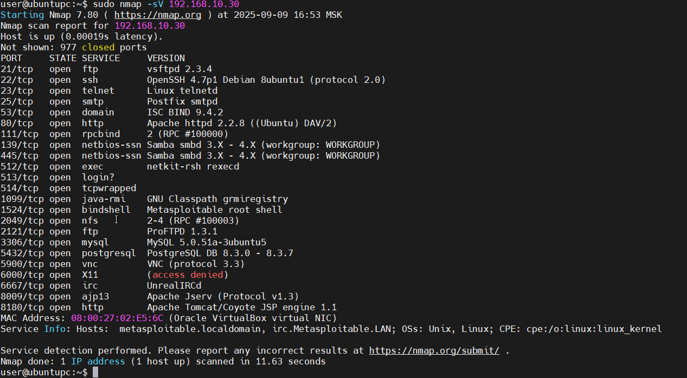

# Домашнее задание к занятию "`Уязвимости и атаки на информационные системы`" - `Кузовкова Наталья`

------

### Задание 1

Скачайте и установите виртуальную машину Metasploitable: https://sourceforge.net/projects/metasploitable/.

Это типовая ОС для экспериментов в области информационной безопасности, с которой следует начать при анализе уязвимостей.

Просканируйте эту виртуальную машину, используя **nmap**.

Попробуйте найти уязвимости, которым подвержена эта виртуальная машина.

Сами уязвимости можно поискать на сайте https://www.exploit-db.com/.

Для этого нужно в поиске ввести название сетевой службы, обнаруженной на атакуемой машине, и выбрать подходящие по версии уязвимости.

Ответьте на следующие вопросы:

- Какие сетевые службы в ней разрешены?
- Какие уязвимости были вами обнаружены? (список со ссылками: достаточно трёх уязвимостей)  

  
- [OpenSSH 2.3 < 7.7 - Username Enumeration](https://www.exploit-db.com/exploits/45233)  
- [Apache < 2.2.34 / < 2.4.27 - OPTIONS Memory Leak](https://www.exploit-db.com/exploits/42745)
- [ProFTPd IAC 1.3.x - Remote Command Execution](https://www.exploit-db.com/exploits/15449)

### Задание 2

Проведите сканирование Metasploitable в режимах SYN, FIN, Xmas, UDP.

Запишите сеансы сканирования в Wireshark.

Ответьте на следующие вопросы:

- Чем отличаются эти режимы сканирования с точки зрения сетевого трафика?
- Как отвечает сервер?

*SYN - клиент отправляет SYN запрсы на порты. Если порт открыт , сервер отвечает SYN-ACK.  
Клиент не завершает рукопожатие , отправляет RST (не завершает соединение). Если порт закрыт , сервер отвечает RST-ACK.  

FIN  - Клиент отправляет FIN-пакет. Открытый порт на сервере — игнорирует FIN-пакет (ничего не отвечает). Закрытый порт — отвечает RST  

Xmas - Клиент отправляет пакет с флагами FIN+URG+PSH. Открытый порт — не отвечает. Закрытый порт — отвечает RST  

UDP -  Клиент отправляет UDP запросю Если порт на сервере открыт - ни чего не происходит. Если закрыт - сервер отвечает ICMP Port Unreachable*